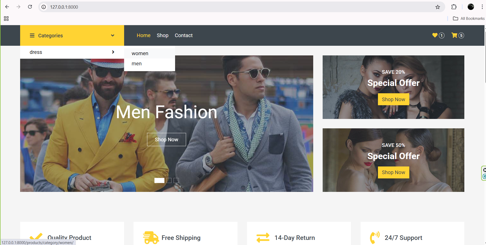
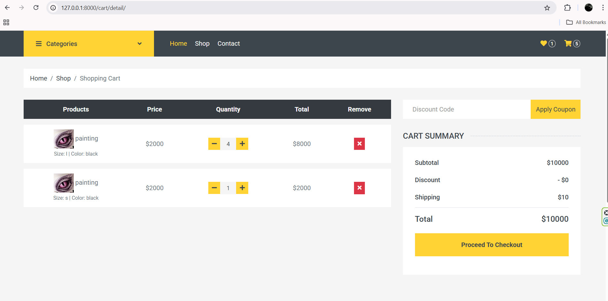
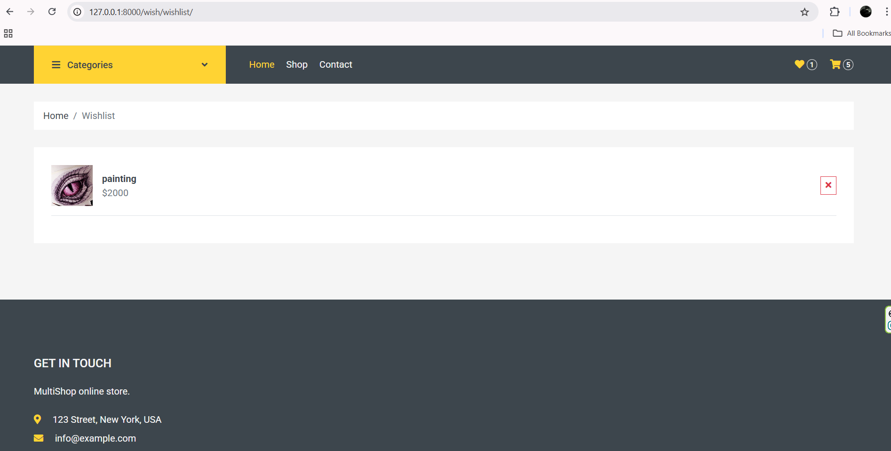
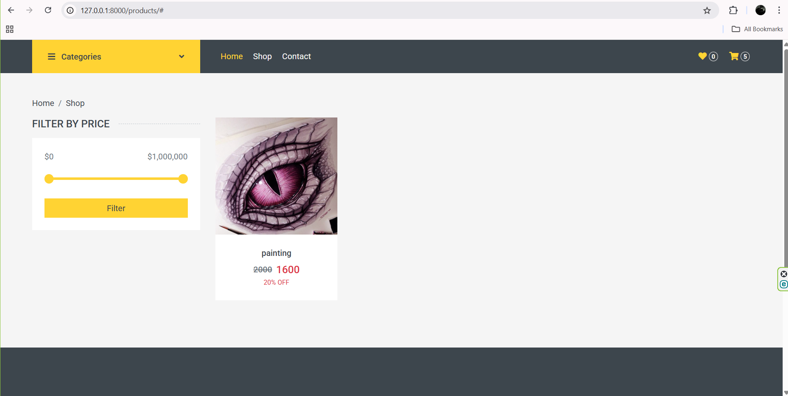
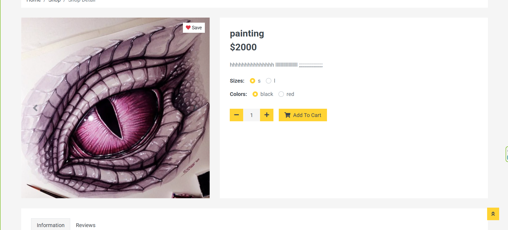
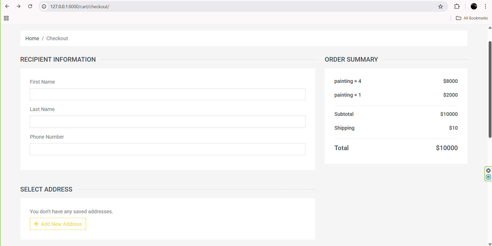
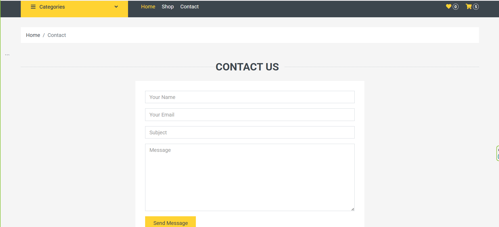

# Django MultiShop

A Django e-commerce backend with OTP login, cart, wishlist, and checkout.

A multi-page e-commerce backend built with Django, made while I was working through backend fundamentals — models, sessions, authentication, and how a real checkout flow fits together end to end.

The project simulates a small online shop: browsing products by category, adding items to a cart, saving products to a wishlist, logging in with OTP over SMS, managing delivery addresses, and placing an order.

## Features

- **Product catalog** — products organized by nested categories, with multiple sizes, colors, and gallery images per product
- **Shopping cart** — session-based cart that tracks quantity, size, and color per item, with a live item-count badge in the navbar
- **Wishlist** — save products for later without needing to pick a size or color first; toggled with a single click, with its own count badge
- **OTP authentication** — registration and login through a phone-number + SMS verification code flow (via Ghasedak), no passwords for regular sign-in
- **Address book** — users can save multiple delivery addresses, each validated for uniqueness and capped per account
- **Checkout** — recipient details, address selection, and payment method (cash on delivery or online) collected in one form
- **Orders** — completed checkouts are stored with their line items, prices, and chosen size/color; each order is only viewable by the user who placed it

## Screenshots

**Home page**


**Shop categories**


**Shopping cart**


**Whishlist page**


**ProductsList page**


**ProductDetail page**


**Shopping ordwe page**


**Contact us page**


## Tech stack

- Python / Django
- SQLite (development)
- Django sessions (cart & wishlist state)
- Ghasedak SMS API (OTP delivery)
- Bootstrap-based templates (MultiShop HTML template, adapted to Django's template engine)

## Project structure

```
multi_shop/       # project settings and root urls
account/          # user model, OTP auth, addresses
product/          # products, categories, sizes, colors
cart/             # session-based cart, checkout, orders
wishlist/         # saved products
home/             # landing page
templates/        # shared templates (base layout)
statics/          # CSS/JS/images
```

Each app owns its own models, views, and URLs, and is wired together through `multi_shop/urls.py`.

## Running it locally

```bash
git clone https://github.com/Beirami13/django-multishop.git
cd django-multishop
python -m venv .venv
.venv\Scripts\activate      # Windows
pip install -r requirements.txt

python manage.py migrate
python manage.py createsuperuser
python manage.py runserver
```

You'll need a Ghasedak API key for OTP-based login/registration to work — set it as an environment variable rather than hardcoding it.

## What's next

Things I know are missing or worth doing better, in roughly the order I plan to tackle them:

- **User profile page** — a page listing a user's past orders and saved addresses in one place, instead of only being able to view a single order by its link
- **Stock tracking** — products don't have a quantity field yet, so nothing stops someone from ordering more than what's actually in stock
- **Discount codes** — there's a `Discount` model already in place, but nothing in checkout uses it yet
- **Order totals stored properly** — `subtotal` and `total_price` exist on the `Order` model but aren't being calculated and saved when an order is created; right now they just sit at their default value
- **Working product search** — the search bar in the navbar is currently just a static form with no view behind it
- **Product reviews** — the star rating shows on product cards, but there's no comment/review system behind it yet, so it's always stuck at 0
- **Pagination** — for the cart and wishlist pages once there are enough items in them to matter
- **Moving the SMS API key out of the code** — it's currently hardcoded in the view instead of read from an environment variable
- **Basic tests** — at least for the cart logic (adding items, calculating totals) and the main checkout flow, since that's the part most likely to break silently

## Notes

This started as a way to practice Django end to end rather than a production shop: the OTP flow, cart, and checkout were all built and debugged incrementally, one feature and one bug at a time. Things like address validation, per-account limits, ownership checks on orders, and duplicate-prevention were added along the way as the checkout flow got fleshed out.

## License

MIT
